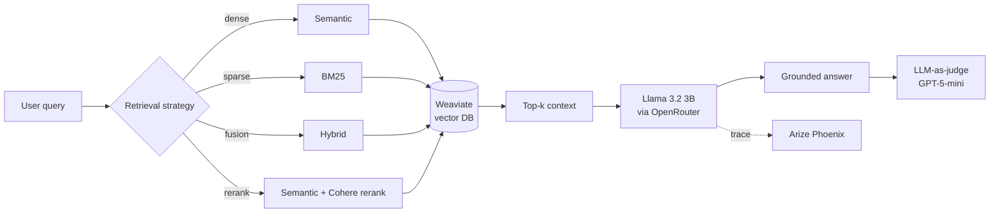

# Multi-Strategy RAG Pipeline

A production-oriented Retrieval-Augmented Generation system that benchmarks **four retrieval strategies against a no-RAG baseline** — built to answer knowledge-intensive questions with *measured*, not asserted, accuracy.

Built as an MSc dissertation project (**awarded Top 5 university-wide**), this goes beyond a standard RAG tutorial: it implements and systematically benchmarks competing retrieval architectures, grades every answer with a **frontier-model LLM-as-a-judge**, integrates real-time tracing, and ships an interactive comparison UI.


---

## TL;DR — headline result

On a 100-query sample from Natural Questions, graded by **GPT-5-mini as an independent judge**, adding retrieval more than **doubled answer accuracy**:

| System            | Accuracy  | Faithfulness | Avg. latency |
|-------------------|:---------:|:------------:|:------------:|
| **RAG (ours)**    | **77.8%** | 61.0%        | 8.55 s       |
| No-RAG baseline   | 32.0%     | —            | 6.47 s       |

> Retrieval is the difference between a 1-in-3 and a 4-in-5 chance of a correct answer — for ~2 s of extra latency.

## What it does

Given a query, the system retrieves documents using one of four strategies, then passes them to Llama 3.2 to generate a grounded answer. All five approaches (including the no-RAG baseline) can run simultaneously and display side by side for direct comparison.



## Retrieval strategies

| Strategy | Description |
|---|---|
| **Semantic search** | Dense vector similarity over Weaviate named vectors |
| **BM25** | Keyword-based sparse retrieval — strong on exact matches and rare terms |
| **Hybrid** | Weighted fusion of semantic and BM25 signals (`alpha` tunable) |
| **Semantic + reranking** | Semantic retrieval followed by Cohere cross-encoder reranking |
| **No RAG (baseline)** | Direct Llama 3.2 generation, no retrieval — isolates parametric knowledge |

## Evaluation: LLM-as-a-judge

Answers are graded automatically rather than by hand. **A frontier model (`gpt-5-mini`) judges a much smaller generator (Llama-3.2-3B)** across three dimensions:

| Metric | Question it answers | Reference used |
|---|---|---|
| **Accuracy** | Is the final answer correct? | ground-truth answer |
| **Relevance** | Is the retrieved context useful? | retrieved context |
| **Faithfulness** | Is the answer grounded in the context? | retrieved context |

Using a stronger model as the judge is deliberate: a 3B generator cannot reliably grade its own output. Phoenix's `HallucinationEvaluator`, `QAEvaluator` and `RelevanceEvaluator` drive the scoring, so every verdict is traceable.

Full methodology, including two known measurement caveats, is in **[EVALUATION.md](EVALUATION.md)**.

## Key findings

Measured, with the judge and sample size stated for each claim:

- **Retrieval more than doubles accuracy** — 77.8% vs 32.0% against the no-RAG baseline (100 queries, judged by GPT-5-mini). This is the project's strongest and best-supported result.
- **BM25 is a remarkably strong, cheap baseline** on short-answer NQ queries — highest relevance (0.40) and the lowest latency (1.72 s) of the four strategies.
- **Hybrid and reranking did not beat plain BM25 here** (0.25 relevance each). On a corpus of short answer strings there is little text for fusion or a cross-encoder to exploit.
- **Reranking was not the latency cost one might expect** — 2.01 s, actually *faster* than plain semantic search (2.76 s).
- **Faithfulness is unreliable on this corpus** and should not be read as a hallucination rate — see the caveat below.

> ⚠️ The four-strategy comparison above used **Llama-3.2-3B as its own judge** on 20 queries — far weaker than the GPT-5-mini judge behind the headline result. Treat those relative rankings as indicative, not conclusive. Re-running that comparison under the GPT-5-mini judge is the highest-value next experiment.

## Monitoring

All LLM traces are logged to Arize Phoenix for real-time observability:
- Latency per retrieval strategy (retrieval vs. generation, broken out)
- Token usage
- Faithfulness and relevance scoring
- Query-level trace inspection

Live dashboard: [app.phoenix.arize.com/s/aamini8118](https://app.phoenix.arize.com/s/aamini8118)

## Interactive comparison UI

The notebook ships with a live widget: type any query, set Top-K, choose a reranking property, and see all five strategy outputs rendered side by side in real time — no switching between cells.

## Tech stack

| Layer | Tools |
|---|---|
| Vector DB | Weaviate (named vectors, hybrid, BM25) |
| Embeddings | `sentence-transformers/all-MiniLM-L6-v2` via Weaviate `text2vec-huggingface` |
| Reranking | Cohere Rerank (server-side in Weaviate) |
| Generator | Llama 3.2 (3B Instruct) via OpenRouter |
| Judge | GPT-5-mini via OpenRouter |
| Observability | Arize Phoenix · OpenInference · OpenTelemetry |
| Interface | Interactive Jupyter widget (ipywidgets) |
| Datasets | Natural Questions (`nq_open`), HotpotQA (`distractor`) |

## Repository structure

```
RAG_Project/
├── RAG.ipynb                 # Main notebook — pipeline, experiments, widget
├── src/rag/                  # Reusable, tested package extracted from the notebook
│   ├── config.py             #   environment-driven settings
│   ├── llm.py                #   provider-agnostic chat client
│   ├── retrieval.py          #   the 4 strategies + a name→function registry
│   ├── prompts.py            #   RAG / no-RAG prompt construction
│   ├── pipeline.py           #   retrieve-then-generate with latency timing
│   └── evaluation.py         #   LLM-as-judge metrics + benchmark loop
├── tests/                    # Unit tests for the pure logic (run in CI)
├── scripts/download_data.py  # Rebuild datasets from HuggingFace
├── utils.py                  # Notebook helpers (LLM calls + comparison widget)
├── EVALUATION.md             # Methodology, caveats, and how to reproduce
└── requirements.txt
```

The notebook is the readable end-to-end story; `src/rag/` is the same logic factored into importable, unit-tested modules:

```python
from rag import RAGPipeline, LLMClient, RETRIEVAL_METHODS, load_settings

settings = load_settings()                     # reads API.env
llm = LLMClient(settings.openrouter_api_key)
pipeline = RAGPipeline(llm, collection)        # a Weaviate collection
result = pipeline.run("Who won the 2018 World Cup?", RETRIEVAL_METHODS["hybrid_alpha_0.8"])
print(result.response, result.total_latency_ms)
```

## Quickstart

```bash
git clone https://github.com/Amirrezaww/RAG_Project.git
cd RAG_Project
pip install -r requirements.txt
```

Add your API keys (see `.env.example` for the full list):

```bash
cp .env.example API.env        # then fill in your keys
```

Rebuild the datasets (they are large and intentionally not committed):

```bash
python scripts/download_data.py
```

Then open `RAG.ipynb` in Jupyter. The interactive widget loads near the end of the notebook.

```bash
pytest -q                      # optional: run the unit tests
```

## Limitations

Honest caveats, expanded in [EVALUATION.md](EVALUATION.md):

- **Faithfulness is ill-posed on the NQ corpus.** It indexes *answers* (often a single entity), not supporting *passages*, so "is this answer grounded in the retrieved text?" has no well-defined target. A passage-level corpus would fix this — HotpotQA's context sentences are the natural next step.
- **The four-strategy comparison used a 3B self-judge** on 20 queries; the headline result used GPT-5-mini on 100.
- **Sample sizes are small.** Scaling to the full 85k QA pairs with bootstrapped confidence intervals is the next step.
- **Single generator size.** Comparing across model families would isolate how much retrieval compensates for parametric weakness.

## About

MSc Data Science dissertation — Middlesex University, 2026.
Recognised as **Top 5 individual project university-wide**.

Built by [Amirreza Amini](https://github.com/Amirrezaww) · [LinkedIn](https://linkedin.com/in/amirreza-amini8118)

## License

[MIT](LICENSE)
