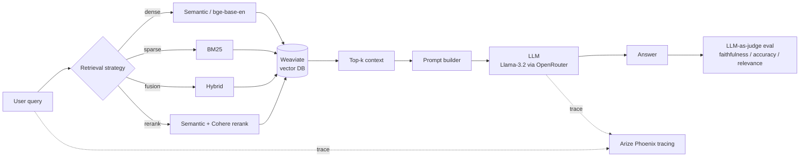

# Multi-Strategy Retrieval-Augmented Generation (RAG)

**Design and evaluation of a multi-strategy RAG pipeline for knowledge-intensive question answering.**

This project implements and **benchmarks four retrieval strategies** — dense semantic search, BM25 keyword search, hybrid fusion, and cross-encoder reranking — inside a single RAG pipeline, then evaluates them against a no-retrieval baseline using an **LLM-as-a-judge** harness with full request tracing.


---

## TL;DR — headline result

On a 100-query sample drawn from Natural Questions, adding retrieval more than **doubled answer accuracy** over the same model with no context:

| System            | Accuracy | Faithfulness | Avg. latency |
|-------------------|:--------:|:------------:|:------------:|
| **RAG (ours)**    | **77.8%** | 61.0%       | 8.55 s       |
| No-RAG baseline   | 32.0%    | —            | 6.47 s       |

> Retrieval is the difference between a 1-in-3 and a 4-in-5 chance of a correct answer here — at the cost of ~2 s of extra latency.

---

## Why this project

Most RAG demos wire up a single retriever and stop. The interesting engineering questions are *comparative*:

- Does **dense** search actually beat classic **BM25** on short-answer QA?
- Does **hybrid fusion** or **reranking** help, or just add latency?
- How much does retrieval improve a small instruction-tuned LLM over its parametric knowledge alone?
- How do you measure any of this **reproducibly**, with tracing you can inspect?

This repo answers those questions with an end-to-end, instrumented pipeline.

## Architecture



## Features

- **Four retrieval strategies** behind a unified interface: semantic (`BAAI/bge-base-en-v1.5`), BM25, hybrid, and semantic + **Cohere reranking**.
- **Weaviate** vector database with named vectors and metadata filtering.
- **No-RAG baseline** for a fair, head-to-head comparison.
- **LLM-as-a-judge evaluation** scoring *faithfulness*, *accuracy*, and *answer relevance*, plus latency breakdowns (retrieval vs. generation).
- **Observability** with **Arize Phoenix** / OpenInference + OpenTelemetry tracing of every retrieval and generation call.
- **Provider-agnostic LLM client** (OpenRouter / Together / OpenAI-compatible).
- **Two real QA datasets**: Natural Questions (`nq_open`) and HotpotQA (multi-hop, `distractor`).

## Per-strategy comparison

On a 20-query evaluation sample (relevance & faithfulness scored 0–1 by the judge):

| Strategy   | Relevance | Faithfulness | Latency |
|------------|:---------:|:------------:|:-------:|
| BM25       | 0.40      | 0.00         | 1.72 s  |
| Semantic   | 0.35      | 0.15         | 2.76 s  |
| Hybrid     | 0.25      | 0.00         | 2.16 s  |
| Reranking  | 0.25      | 0.00         | 2.01 s  |

> On NQ-style short-answer queries, sparse **BM25** is a remarkably strong and cheap baseline, while **semantic** search is the only strategy to register non-zero grounded faithfulness. See [Limitations](#limitations--future-work) for why the faithfulness signal is weak on this corpus — improving it is the main open thread.

## Repository structure

```
RAG_Project/
├── RAG.ipynb                 # End-to-end narrative: ingest → retrieve → generate → evaluate
├── src/rag/                  # Reusable, tested package extracted from the notebook
│   ├── config.py             #   environment-driven settings
│   ├── llm.py                #   provider-agnostic chat client
│   ├── retrieval.py          #   the 4 strategies + a name→function registry
│   ├── prompts.py            #   RAG / no-RAG prompt construction
│   ├── pipeline.py           #   retrieve-then-generate with latency timing
│   └── evaluation.py         #   LLM-as-judge metrics + benchmark loop
├── tests/                    # Unit tests for the pure logic (run in CI)
├── scripts/download_data.py  # Regenerate datasets from HuggingFace
├── utils.py                  # Notebook helpers (LLM calls + comparison widget)
├── data/rag_evaluation_results.csv   # Saved evaluation outputs
├── pyproject.toml            # Package + pytest config
├── requirements.txt
└── .env.example              # Required API keys (copy to API.env)
```

The notebook is the readable, end-to-end story; `src/rag/` is the same logic
factored into clean, importable, unit-tested modules:

```python
from rag import RAGPipeline, LLMClient, RETRIEVAL_METHODS, load_settings

settings = load_settings()                     # reads API.env
llm = LLMClient(settings.openrouter_api_key)
pipeline = RAGPipeline(llm, collection)         # a Weaviate collection
result = pipeline.run("Who won the 2018 World Cup?", RETRIEVAL_METHODS["hybrid_alpha_0.8"])
print(result.response, result.total_latency_ms)
```

## Getting started

```bash
# 1. Install dependencies
pip install -r requirements.txt

# 2. Configure API keys
cp .env.example API.env        # then fill in your keys

# 3. Download / regenerate the datasets (not committed — they are large)
python scripts/download_data.py --max-examples 85000

# 4. Run the notebook
jupyter lab RAG.ipynb

# (optional) run the unit tests for the src/rag package
pytest -q
```

You'll need accounts/keys for: a **Weaviate** cluster, **OpenRouter** (LLM), **Cohere** (reranking), **HuggingFace** (embeddings), and **Arize Phoenix** (tracing). See `.env.example` for the full list.

## Tech stack

| Layer            | Tooling                                              |
|------------------|------------------------------------------------------|
| Vector DB        | Weaviate (named vectors, hybrid, BM25)               |
| Embeddings       | `BAAI/bge-base-en-v1.5` (HuggingFace)                |
| Reranking        | Cohere Rerank                                        |
| Generation       | Llama-3.2-3B-Instruct via OpenRouter (swappable)     |
| Evaluation       | LLM-as-a-judge (faithfulness / accuracy / relevance) |
| Observability    | Arize Phoenix · OpenInference · OpenTelemetry        |
| Datasets         | Natural Questions (`nq_open`), HotpotQA (`distractor`) |

## Limitations & future work

This is a research project; results come from samples (20–100 queries) and have caveats worth being explicit about:

- **Faithfulness scores are near zero for most strategies.** The NQ corpus stores *answers* (often single entities) rather than passages, so "is the answer grounded in the retrieved text?" is an ill-posed question on this data. A passage-level corpus (e.g. Wikipedia chunks) would make faithfulness meaningful.
- **The generator occasionally restates the prompt** ("Based on the additional information provided…"), which inflates verbosity and can confuse the judge. Prompt hardening is in progress.
- **Sample sizes are small.** Scaling evaluation to the full 85k QA pairs (and bootstrapping confidence intervals) is the next step.
- **Single small generator.** Comparing across model sizes/families would isolate how much retrieval compensates for parametric weakness.

## License

[MIT](LICENSE)
